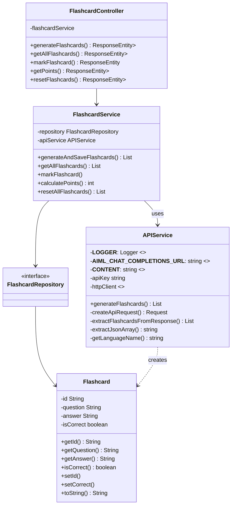
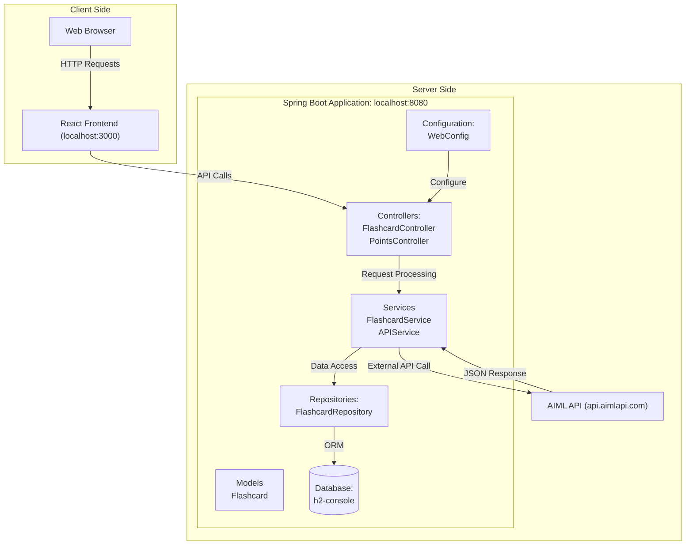

# team04-404_speed_not_found-projekt2quizbot

___________________________________________________________________

# Running the application locally
## run backend
```cd backend/```
```gradle wrapper```
```./gradlew build```
```./gradlew bootRun```

## run frontend
```cd frontend/quizbot```
```npm install```
```npm start```

## open in browser
```http://localhost:3000```
___________________________________________________________________

# UML Diagrams

## Class Diagram


## Architecture Diagram

Testing Concept for QuizBot Application

[-> Testing Concept](Testing_Concept.md)
