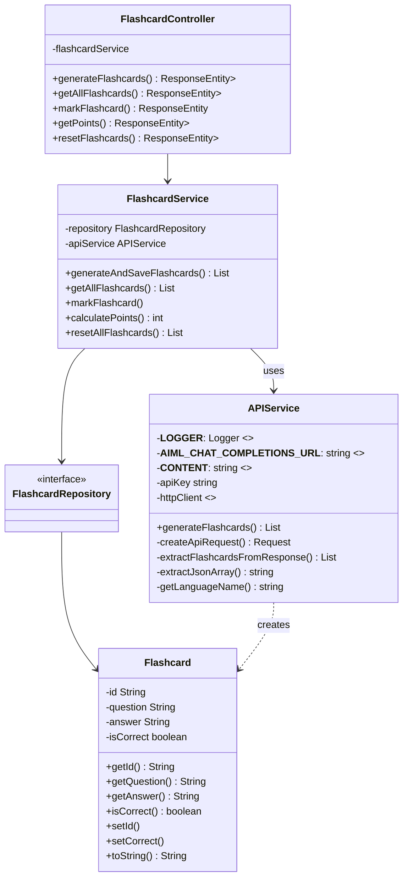
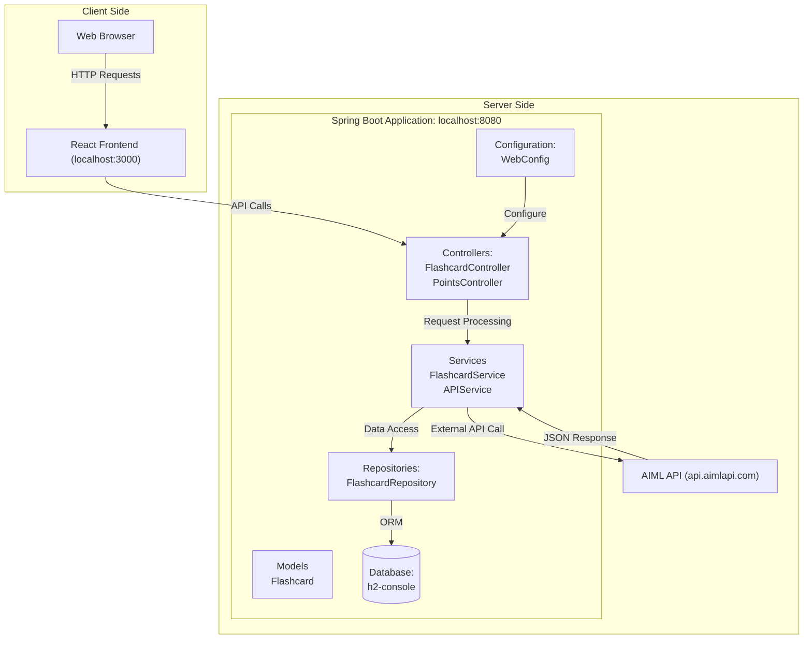

# team04-404_speed_not_found-projekt2quizbot
- [Running the application locally](#running-the-application-locally)
- [QuizBot](#quizbot)
  - [Welcome to QuizBot!](#welcome-to-quizbot)
  - [Flashcard Generation](#flashcard-generation)
  - [Points System](#points-system)
  - [User Interface](#user-interface)
  - [Usage](#usage)
  - [Use cases](#use-cases)
  - [Technologies Used](#technologies-used)
  - [Branching Strategy](#branching-strategy)
- [UML Diagrams](#uml-diagrams)
  - [Class Diagram](#class-diagram)
  - [Architecture Diagram](#architecture-diagram)
- [Testing](#testing)
  - [Backend Testing](#backend-testing)
  - [Frontend Testing](#frontend-testing)
  - [Running Tests](#running-tests) TODO
- [Mentionable Pull Requests](#mentionable-pull-requests)
___________________________________________________________________

# Running the application locally
## run backend
```cd backend/```
```gradle wrapper```
```./gradlew build```
```./gradlew bootRun```

## run frontend
```cd frontend/quizbot```
```npm install```
```npm start```

## open in browser
```http://localhost:3000```
___________________________________________________________________

# QuizBot
## Welcome to QuizBot!
QuizBot is an interactive learning tool designed to help users learn and retain information through flashcards. The application leverages AI technology to generate flashcards based on user input, making the learning process more efficient and engaging.

## Flashcard Generation
Users can generate flashcards by providing a topic. The application uses an external AI service to create flashcards that include questions and answers. Users can then review these flashcards to enhance their learning experience.

## Points System
QuizBot includes a points system that rewards users for correctly answering flashcard questions. Users can track their progress and see how many points they have accumulated during their learning sessions. The points system encourages users to engage with the flashcards and reinforces their learning.

## User Interface
The user interface is designed to be intuitive and user-friendly. Users can easily navigate through the application, generate flashcards, and track their points. The frontend is built using React, providing a responsive and dynamic experience.

## Usage
1. **Generate Flashcards**: Enter a topic, enter the amount of flashcards you want to generate, and click the "Generate" button. The application will fetch flashcards from the AI service and display them.
2. **Practice Flashcards**: The generated flashcards will be displayed one by one. Users can mark them as correct or incorrect based on their knowledge. Correct answers will earn points.

## Use cases
- **Student Learning**: Students can use QuizBot to study for exams by generating flashcards on specific subjects.
- **Language Learning**: Language learners can create flashcards for vocabulary and grammar rules.
- **General Knowledge**: Users can explore various topics and test their knowledge through flashcards.
- **Quiz Preparation**: QuizBot can be used to prepare for quizzes and tests by generating relevant flashcards.
- **Interactive Learning**: The application promotes interactive learning by allowing users to engage with the content actively.
- **Quiz Creation**: Users can create custom quizzes by generating flashcards on specific topics.

## Technologies Used
- **Backend**: Spring Boot, Java 21
- **Frontend**: React, TypeScript
- **Database**: H2 (in-memory database for development)
- **AI Service**: External API for flashcard generation [AI/ML API](https://aimlapi.com/)
- **Build Tool**: Gradle
- **Version Control**: Git
- **Testing**: JUnit, Mockito

## Branching Strategy
The project follows a branching strategy to differentiate between frontend and backend development. Each developer works on their own branch, the development branch is used for integration, and the main branch is reserved for stable releases. The following branches are used:
- **main**: The main branch contains the stable version of the application.
- **development**: The development branch is used for ongoing development and integration of new features.
- **frontend/<developer_name>**: Each frontend developer has their own branch for implementing frontend features.
- **backend/<developer_name>**: Each backend developer has their own branch for implementing backend features.
___________________________________________________________________

# UML Diagrams

## Class Diagram


## Architecture Diagram

___________________________________________________________________
# Testing
## Backend Testing
Automated tests are provided for the backend using JUnit and Mockito. The test cases are defined in the [Testing Concept](Testing_Concept.md) document.
## Frontend Testing
The frontend will be testend manually using the test cases provided in the [Testing Concept](Testing_Concept.md) document.

## Running Tests
TODO
___________________________________________________________________
# Mentionable Pull Requests
- Backend: ConfigLoader, FlashcardController, APIService Implementation [#32](https://github.zhaw.ch/PM2-IT24taZH-meea-lieh-kars/team04-404_speed_not_found-projekt2quizbot/pull/32)
- Backend: WebConfig, FlashcardService, PointsService Implementation [#34](https://github.zhaw.ch/PM2-IT24taZH-meea-lieh-kars/team04-404_speed_not_found-projekt2quizbot/pull/34)
