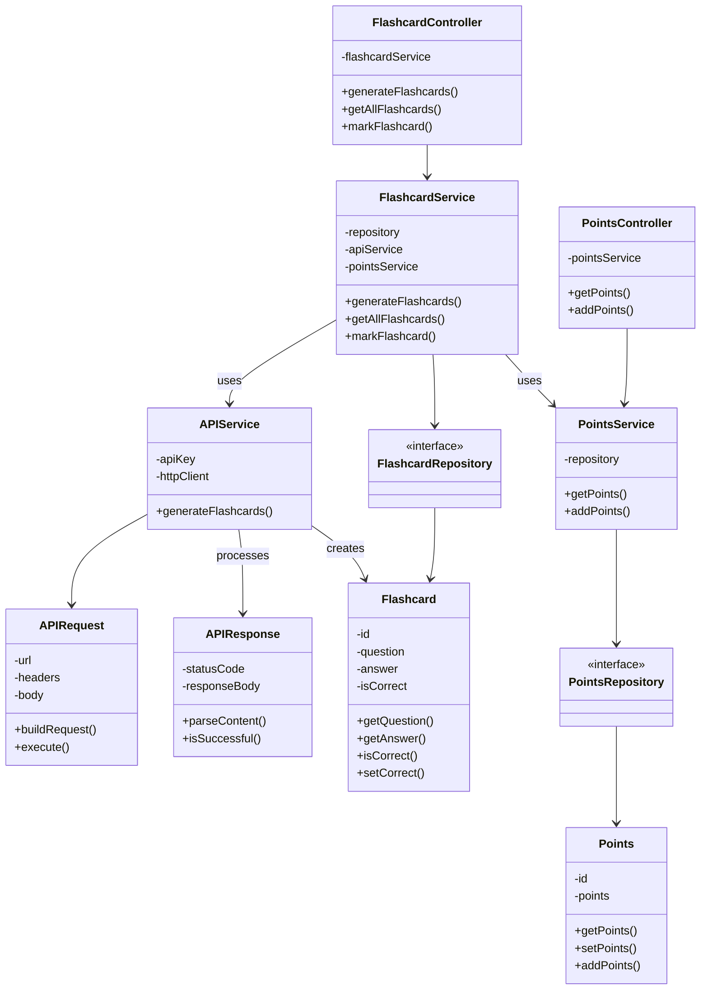

# team04-404_speed_not_found-projekt2quizbot

## run backend
```cd backend/```
```gradle wrapper```
```./gradlew build```
```./gradlew bootRun```

## run frontend
```cd frontend/quizbot```
```npm start```
___________________________________________________________________

# UML Diagrams

## Class Diagram


## Architecture Diagram


